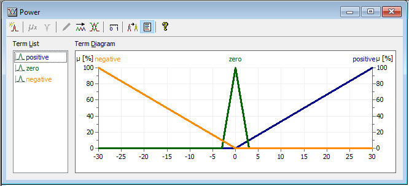

Bartosz Ujazdowski - 202322

== Ręczne sterowanie
Ustawienie zmiennej power na wartość wiekszą niz 13 doprowadza do zbyt dużego kątu odchylenia. 
Trzymanie wartości mniejszej niz 13 pozwala na lepsze kontrolowanie odchyłu ładunku dzięki czemu możemy dużo łatwiej ustawić ładunek nad celem.

== Fuzzy Logic

=== Zmienne regulatora
Regulator ma dwie zmienne wejśiowe: *Angle* i *Distance* oraz jedną zmienną wyjściową *Power*

Zbiory zmiennej *Angle* to: _high_, _medium_ i _low_
Zbiory zmiennej *Distance* to: _positive_, _zero_ i _negative_
Zbiory zmiennej *Power* to: _positive_, _zero_ i _negative_

=== Reguły

=== Ustawienie zmiennych

.Angle

.Distance

.Power

Taki regulator jest bezpieczny i o wiele szybszy niż próby manualne. 
Sterowanie manualne nie jest zbyt bezpieczne i jednocześnie sterując manualnie osiągamy gorsze wyniki. 